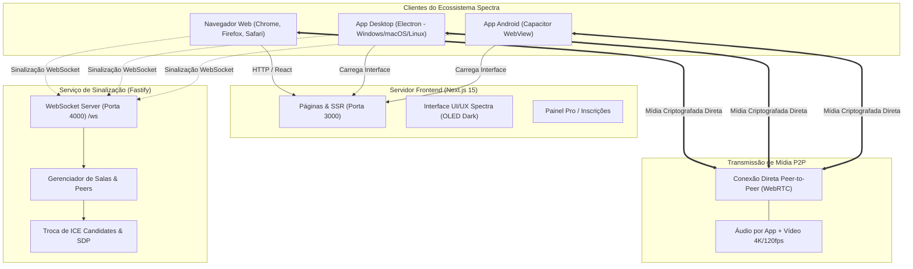

# Relatório Técnico de Fork e Changelog: GoLive → Spectra

**Documento**: Auditoria de Migração, Linhagem e Registro de Modificações  
**Data**: 11 de Setembro de 2026  
**Horário**: 15:45:00 GMT-3 (Horário de Brasília)  
**Ano**: 2026  
**Autor / Mantenedor**: [eobarretooo](https://github.com/eobarretooo)  
**Repositório Base Original**: [Nem-Tudo/group-sharescreen](https://github.com/Nem-Tudo/group-sharescreen) (GoLive)  
**Repositório do Fork Oficial**: [eobarretooo/Spectra](https://github.com/eobarretooo/Spectra) (Spectra)  

---

## 1. Resumo Executivo e Motivação

O **Spectra** é uma plataforma independente de compartilhamento de tela, áudio e vídeo de altíssima fidelidade e latência sub-segundo, construída sobre tecnologias WebRTC P2P e desenvolvida como um fork do projeto `group-sharescreen` (originalmente conhecido publicamente como GoLive).

### Motivação do Fork
1. **Independência de Plataformas Fechadas**: Oferecer uma alternativa robusta e privada para chamadas e transmissões após restrições e banimentos de compartilhamento de tela em redes proprietárias como o Discord.
2. **Autonomia de Infraestrutura**: Eliminar a dependência de servidores de sinalização remotos de terceiros, restaurando um backend local e autônomo baseado em WebSockets (Fastify).
3. **Identidade Visual Própria**: Substituição completa da identidade visual anterior pela marca **Spectra**, adotando uma estética contemporânea *Dark OLED*, com gradientes *Electric Cyan* e *Ultraviolet*.
4. **Expansão Multiplataforma**: Criação e estruturação de clientes para desktop (Windows, macOS, Linux) e introdução do suporte nativo para dispositivos móveis (**Android**) com integração de compilação contínua (CI/CD via GitHub Actions).
5. **Preparação para Monetização e Assinaturas**: Preservação e modularização da arquitetura do plano Pro para integração personalizada de gateways de pagamento (Pix, Mercado Pago, Stripe).

---

## 2. Inventário de Arquivos e Módulos Criados

Os seguintes arquivos e subsistemas foram criados do zero no projeto:

| Arquivo / Diretório | Função / Descrição Técnica |
|---|---|
| `backend/` | **Novo microserviço autônomo de sinalização WebRTC** construído com Fastify 5 e `@fastify/websocket`. |
| `backend/src/index.ts` | Ponto de entrada do servidor de sinalização na porta `4000`, expondo endpoints de healthcheck (`/health`), métricas Prometheus (`/metrics`) e listagem de salas ativas (`/rooms`). |
| `backend/src/signaling.ts` | Motor de sinalização WebRTC responsável pelo registro de clientes, criação de salas, repasse de mensagens SDP (offer/answer), ICE candidates, chat e moderação em tempo real. |
| `backend/src/metrics.ts` | Coleta de telemetria, contagem de conexões ativas, mensagens transmitidas e tráfego WebRTC. |
| `backend/src/adminAuth.ts` | Camada de autenticação para endpoints de administração e métricas via token Bearer. |
| `backend/package.json` | Dependências isoladas do backend (`fastify`, `@fastify/websocket`, `@fastify/cors`, `tsx`). |
| `backend/tsconfig.json` | Configuração TypeScript moderna com resolução NodeNext para o backend. |
| `.github/workflows/build-android.yml` | **Pipeline de CI/CD no GitHub Actions** para compilar automaticamente o APK de debug do aplicativo Android com Java 17 e Android SDK. |
| `public/spectra-logo.svg` | **Logotipo vetorial oficial do Spectra**, apresentando um prisma geométrico cristalino tridimensional em gradientes ciano e violeta. |
| `.env.local` | Configurações de ambiente para sinalização local (`NEXT_PUBLIC_SIGNALING_URL=ws://localhost:4000/ws`, STUN Google e flags de relay). |
| `docs/2026-09-11_fork-golive-spectra-relatorio.md` | Este documento de auditoria técnica e governança do fork. |

---

## 3. Itens e Módulos Deletados ou Descontinuados

Para garantir uma plataforma limpa, autônoma e segura, diversos componentes legados do repositório original foram descontinuados e removidos:

| Item Removido | Justificativa Técnica |
|---|---|
| **Bot do Discord (`/discord-bot`, `bot.ts`)** | O bot do Discord do projeto original dependia de infraestrutura externa e tokens fechados. Os links de navegação no cabeçalho e sitemap foram removidos para focar na experiência direta Web/App do Spectra. |
| **Banners de Publicidade de Terceiros (Adsterra)** | Removemos rastreadores intrusivos e anúncios de terceiros que comprometiam a performance de carregamento e a privacidade dos usuários. |
| **Avisos de Servidor e Redirecionamentos Externos** | Mensagens estáticas no código que redirecionavam usuários para servidores de Discord de terceiros foram eliminadas do código-fonte. |
| **Domínios e Endpoints Legados do GoLive** | Eliminação de requisições duras direcionadas a `golive.nemtudo.me` e APIs legadas, substituindo-as pela configuração flexível de variáveis de ambiente. |

---

## 4. Modificações e Melhorias Realizadas

### A) Rebranding Global (35 Rotas Atualizadas)
* **Design Tokens e Estilo (`app/globals.css`)**:
  * Paleta de cores escura calibrada para telas OLED (`#0a0b10`), alto contraste e proteção ocular.
  * Novas classes de estilo utilitárias: `.spectra-eq-bar` (animação de equalizador de áudio), `.spectra-live-dot` (pulso de status ao vivo), `.spectra-shine` (efeito de reflexo sutil).
* **Metadados e SEO (`app/layout.tsx`, `app/manifest.ts`, `app/robots.ts`, `app/sitemap.ts`, `lib/seo.ts`)**:
  * Título oficial atualizado para **Spectra** em todas as páginas.
  * Favicon SVG de alta resolução apontando para `/spectra-logo.svg`.
  * OpenGraph e Twitter Cards configurados para a marca Spectra.
  * Manifesto PWA configurado com `name: Spectra` e `short_name: Spectra`.

### B) Cliente Desktop para PC (Electron)
* **Metadados de Distribuição (`electron-builder.yml`)**:
  * `productName`: **Spectra**
  * `appId`: `live.spectra.app`
  * `owner / repo`: `eobarretooo/Spectra`
  * `protocols`: Registro no Windows/macOS do scheme nativo `spectra://`
* **Instalador Windows (`electron/build/installer.nsh`)**:
  * Diretório de dados configurado para `%APPDATA%\Spectra`.
* **Código Fonte do Electron (`electron/main.ts`, `electron/preload.ts`, `electron/picker.html`)**:
  * Título da janela principal e seletores de tela configurados para Spectra.

### C) Aplicativo Nativo para Android (Capacitor)
* **Identificação do Pacote**:
  * `capacitor.config.ts`: `appId: "live.spectra.app"`, `appName: "Spectra"`.
  * `android/app/build.gradle`: `applicationId "live.spectra.app"`.
  * `android/app/src/main/res/values/strings.xml`: `app_name: Spectra`.
* **Deep Linking**:
  * Adicionado filtro de intenção no `AndroidManifest.xml` para captura do protocolo `spectra://`.
* **Ponte Nativa**:
  * `lib/capacitorBridge.ts`: Exposição de `window.spectra` para comunicação bidirecional com a WebView nativa.

### D) Página de Download e Distribuição (`app/app/`)
* Totalmente repaginada com guia de vantagens do aplicativo desktop (áudio individual por app, transmissão com aceleração de hardware GPU e atalhos globais).
* Links de download direcionando para a aba de *Releases* do repositório oficial do usuário: `https://github.com/eobarretooo/Spectra/releases`.

### E) Infraestrutura do Plano Pro
* A arquitetura de planos (`Pro` e `Pro Max`) em `app/pro/` e `lib/entitlements.ts` foi mantida limpa e modularizada, preservando o formulário, cálculo de preços (mensal/anual), listagem de benefícios e gatilhos de modal, permitindo a fácil inclusão de um gateway de pagamento (Pix / Mercado Pago / Stripe) por parte do autor.

---

## 5. Diagrama da Arquitetura do Sistema



---

## 6. Instruções de Compilação e Execução

### Execução Local
1. **Instalar dependências**:
   ```powershell
   npm.cmd install
   npm.cmd --prefix backend install
   ```
2. **Iniciar o Servidor de Sinalização**:
   ```powershell
   npm.cmd run backend:dev
   ```
3. **Iniciar o Frontend Web**:
   ```powershell
   npm.cmd run dev
   ```

### Geração de Releases
* **Desktop (Windows/Mac/Linux)**:
  ```powershell
  npm.cmd run electron:build
  ```
* **Android (APK)**:
  * O build é disparado automaticamente a cada push ou release via GitHub Actions no arquivo `.github/workflows/build-android.yml`.
